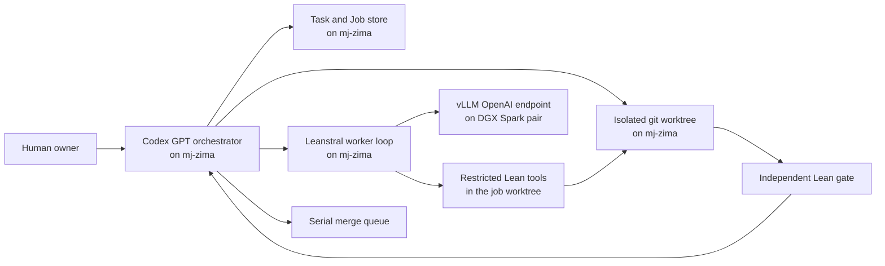

# Harness v2 Specification

Status: design ready; runtime not yet implemented

## Outcome

Codex GPT runs on `mj-zima` as the sole orchestrator. It selects and reviews
small Lean tasks, dispatches bounded proof attempts to Leanstral through an
OpenAI-compatible vLLM endpoint on the DGX Spark pair, executes Lean tools in
isolated `mj-zima` worktrees, and merges only independently verified diffs.

Leanstral is a proof worker. It does not select the project frontier, modify
`main`, accept its own output, manage other jobs, or claim completion.

## Control and Inference Planes



The repository and Lean toolchain live on `mj-zima`. The Sparks serve model
tokens only. This avoids synchronizing mutable git worktrees to GPU nodes and
keeps compilation evidence beside the exact diff it verifies.

## Task and Job

### Task

A Task is a durable unit of mathematical work. It is immutable once a Job has
started; corrections create a new revision or superseding Task.

Required content:

- stable task ID and schema version;
- exact base commit;
- theorem-shaped objective;
- allowed and forbidden file scope;
- named context files and symbols;
- dependency task IDs;
- ordered acceptance commands expressed as argument arrays;
- forbidden-token policy;
- explicit valid stop conditions;
- attempt, time, token, and disk budgets;
- current task state and revision.

Task states:

```text
proposed -> ready -> active -> accepted
                    |    |
                    |    +-> blocked
                    +------> superseded
```

`accepted` means the orchestrator independently ran the gate and recorded the
accepted commit. `blocked` requires an exact unresolved Lean shape and evidence,
not merely a worker saying the problem was difficult.

### Job

A Job is one execution attempt against one Task revision.

It records:

- task ID, task revision, attempt number, and unique job ID;
- worker backend, exact model ID, model revision, endpoint, and sampling config;
- base commit, worktree path, branch, and lease;
- prompt snapshot and hashes of every supplied context artifact;
- start/end timestamps, heartbeat, resource budget, and exit reason;
- raw model messages and tool calls;
- final diff, compiler output, worker report, and orchestrator review;
- gate results and accepted commit when applicable.

Job states:

```text
queued -> preparing -> running -> reviewing -> passed
                    |       |          |
                    |       |          +-> rejected
                    |       +------------> blocked
                    +--------------------> interrupted
```

A passed Job does not automatically accept the Task. Acceptance is a separate
orchestrator transition after the recorded gate succeeds.

## Worker Loop

1. Acquire a file-scope lease and create `codex/<task-id>/<job-id>` from the
   Task's base commit.
2. Reuse a compatible Lean cache without mutating another active worktree's
   cache.
3. Build a bounded prompt from the worker contract, Task, exact declarations,
   relevant files, and prior failed Job summaries.
4. Run Leanstral with restricted tools: read/search files, apply a patch inside
   the worktree, and run allowlisted Lean/git diagnostic commands.
5. Preserve every tool result and heartbeat. Stop on budget, lease loss,
   repeated identical failure, or a Task stop condition.
6. Run cheap automatic hygiene checks, then the Task acceptance commands.
7. Ask Codex GPT to review the exact diff and evidence. It may reject, accept,
   or create a narrower repair Job.
8. Merge accepted work serially, rerun root integration checks, then update the
   Task and handoff state.

Do not give Leanstral an unrestricted shell or permission to remove worktrees,
change remotes, edit `main`, manage model processes, or write outside its
worktree and job-artifact directory.

## Prompt Shape

The worker prompt should contain, in this order:

1. immutable worker contract;
2. objective and frozen theorem type;
3. exact base commit and allowed paths;
4. named definitions with source locations;
5. the smallest relevant source excerpts or full small files;
6. prior attempt summaries, deduplicated;
7. acceptance commands and stop conditions;
8. required final report format.

Do not send all 828 root imports. Retrieval should start from the target symbol,
direct imports, direct consumers, and compiler errors. Prompt snapshots must be
stored so a Job is reproducible even if Task prose later changes.

## Gate Policy

Every Task gate includes:

1. diff scope and clean patch check;
2. added-token scan for `sorry`, `admit`, axioms, postulates,
   `native_decide`, and forbidden target rewrites;
3. focused elaboration of each changed Lean module;
4. `#print axioms` for named deliverables when applicable;
5. exact declaration probes required by the Task;
6. orchestrator review of whether hypotheses are used and content is
   non-vacuous.

Root elaboration and broader audits run after serial integration. The expensive
full build and generated status run at deliberate checkpoints. Baseline
failures must be recorded separately from regressions introduced by the Job.

## Runtime State

Use SQLite for queue/lease transitions and an append-only artifact tree for
large evidence:

```text
harness/v2/state/                 # ignored runtime state
  harness.sqlite3
  jobs/<job-id>/
    task.json
    job.json
    prompt.md
    messages.jsonl
    tool-calls.jsonl
    worker.patch
    gate.json
    review.md
    final-report.md
```

Committed Task/Job examples and JSON Schemas live under `harness/v2/`; real
runtime state, model endpoints, and secrets do not.

SQLite transitions must use a lease owner and expiry. A stale heartbeat may
release a Job for recovery, but it must never delete the old worktree or
artifacts automatically.

## tmux Layout on mj-zima

Start with three persistent sessions:

- `poincare-control`: Codex GPT orchestrator and merge queue.
- `poincare-workers`: dispatcher and active worker loops.
- `poincare-observe`: read-only status, queue, resource, and log tails.

The database and filesystem are the source of restart state; tmux scrollback is
not. Each process writes a PID, Job ID, heartbeat, and structured log before it
starts work.

## Leanstral Deployment Gate

Pin the exact model, not the label "Leanstral 1.5":

```text
mistralai/Leanstral-1.5-119B-A6B
```

The [official model card](https://huggingface.co/mistralai/Leanstral-1.5-119B-A6B)
describes a 119B MoE model with 6.5B active parameters, 256k maximum context,
<=200k recommended context, temperature 1.0, and high reasoning for complex
prompts. Its documented vLLM recipe requires vLLM >=0.24.0 and uses tensor
parallel size 4. The local two-Spark topology therefore needs a measured
feasibility test; successful multi-node loading is not assumed.

Phase 0 exit criteria:

- exact model revision and storage path recorded;
- existing Ray/GPU work has an owner and is not interrupted;
- vLLM, `mistral_common`, attention backend, tool parser, and reasoning parser
  versions are verified on a separate environment;
- the model loads on the intended two-node topology or a documented quantized
  fallback is selected;
- `/v1/models` and one deterministic chat/tool smoke succeed from `mj-zima`;
- a 64k Lean prompt and a 32k completion budget complete without OOM;
- throughput, TTFT, peak GPU memory, and failure behavior are recorded;
- the endpoint binds to an intentional private interface and does not reuse an
  occupied port.

Only after Phase 0 passes should the proof harness depend on the endpoint.

## Rollout Phases

### Phase 0: Provision and measure

- put `~/.local/bin` on the orchestrator service PATH;
- clone the exact repository and verify the Lean toolchain on `mj-zima`;
- inventory the existing Ray cluster, ports, disk, and model storage;
- download and pin Leanstral 1.5;
- run the deployment exit criteria above without disturbing current work.

### Phase 1: One Task, one Job

- implement schema validation, SQLite queue, worktree creation, prompt
  snapshots, one Leanstral worker loop, and the independent gate;
- use one small theorem repair with no concurrent files;
- require manual approval before the first merge.

### Phase 2: Recovery and review

- add leases, heartbeats, resume, interruption classification, baseline-vs-diff
  failures, GPT repair/review Jobs, and serial integration checks;
- make every action idempotent after a process or tmux restart.

### Phase 3: Controlled parallelism

- permit multiple Jobs only for disjoint file families and available Lean/GPU
  budgets;
- keep a single merge queue;
- score the system on accepted theorem-bearing diffs, regression rate, human
  review time, and cost per accepted Task, not raw attempts or generated lines.

## Stop Conditions

The orchestrator stops dispatching when:

- the base commit or target type changed;
- the required file lease is held;
- the model endpoint is unhealthy or its GPUs have another owner;
- three attempts repeat the same blocking shape without new evidence;
- focused Lean checks expose a broader prerequisite than the Task scope;
- disk, token, wall-clock, or compiler budget is exhausted;
- acceptance would require weakening the target or adding a forbidden axiom.

It should then preserve the diff and logs, classify the blocker, and create a
narrower proposed Task. It must not silently widen worker authority.
