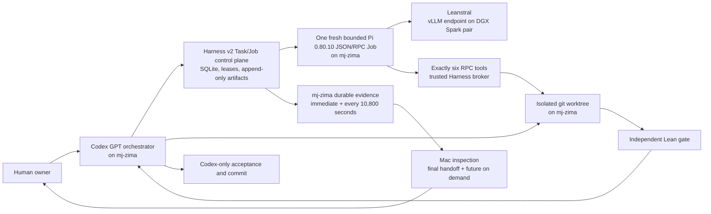

# Harness v2 Specification

Status: executable control plane; the first live Pi-backed proof Job is the
current integration gate

## Outcome

Codex GPT runs on `mj-zima` as the sole orchestrator. It selects and reviews
small Lean Tasks, records each attempt as a Harness v2 Job, and launches one
fresh bounded Pi session per Job. Pi calls Leanstral through the existing
OpenAI-compatible vLLM endpoint on the DGX Spark pair. Scoped tools execute in
the trusted Harness broker against isolated `mj-zima` worktrees; the Pi process
never mounts those worktrees. Codex commits only independently verified diffs.

Pi is the Job execution engine, not a second project coordinator. Leanstral is
a proof worker. Neither selects the project frontier, modifies `main`, accepts
its own output, commits, manages other Jobs, or claims completion.

## Control and Inference Planes



The repository and Lean toolchain live on `mj-zima`. The Sparks serve model
tokens only. This avoids synchronizing mutable git worktrees to GPU nodes and
keeps compilation evidence beside the exact diff it verifies.

## Task and Job

### Task

A Task is a durable unit of mathematical work. It is immutable once a Job has
started; corrections create a new revision or superseding Task.

Required content:

- stable task ID and schema version;
- exact base commit;
- theorem-shaped objective;
- allowed and forbidden file scope;
- named context files and symbols;
- dependency task IDs;
- ordered acceptance commands expressed as argument arrays;
- forbidden-token policy;
- explicit valid stop conditions;
- attempt, time, token, and disk budgets;
- current task state and revision.

Task states:

```text
proposed -> ready -> active -> accepted
                    |    |
                    |    +-> blocked
                    +------> superseded
```

`accepted` means the orchestrator independently ran the gate and recorded the
accepted commit. `blocked` requires an exact unresolved Lean shape and evidence,
not merely a worker saying the problem was difficult.

### Job

A Job is one execution attempt against one Task revision.

It records:

- task ID, task revision, attempt number, and unique job ID;
- worker backend, exact model ID, model revision, endpoint, and sampling config;
- base commit, worktree path, branch, and lease;
- prompt snapshot and hashes of every supplied context artifact;
- start/end timestamps, heartbeat, resource budget, and exit reason;
- raw model messages and tool calls;
- final diff, compiler output, worker report, and orchestrator review;
- gate results and accepted commit when applicable.

Job states:

```text
queued -> preparing -> running -> reviewing -> passed
                    |       |          |
                    |       |          +-> rejected
                    |       +------------> blocked
                    +--------------------> interrupted
```

A passed Job does not automatically accept the Task. Acceptance is a separate
orchestrator transition after the recorded gate succeeds.

## Job Execution Loop

1. Codex creates `codex/<task-id>/<job-id>` from the Task's exact base commit,
   snapshots the immutable Task/Job contract, and enqueues it. The trusted
   worker plane reserves one execution slot, then atomically acquires the
   fenced file-scope lease. It never creates Tasks or worktrees.
   Claim is serialized with a durable SQLite dispatch switch, so a committed
   deployment stop admits no later Job. A newer Task revision or superseding
   Task is rejected while the prior Task still has any nonterminal Job.
2. Codex prepares a compatible isolated Lean cache without letting one active
   worktree mutate another's cache.
3. Harness snapshots the immutable worker contract, Task revision, exact
   declarations, relevant files and hashes, prior failed Job summaries,
   budgets, and acceptance commands.
4. A trusted supervisor holds one configured global capacity slot and the
   Job-wide execution lock for its complete lifetime. Harness fully reattests
   the sealed Pi install/dependency graph, then starts a
   new Pi process and session for this Job only in JSON mode. Built-in tools,
   extension discovery, skills, templates, themes, context discovery, and
   approval flows are disabled except for the canonical Harness extension. Pi
   runs in a worktree-free Bubblewrap namespace over the attested Node/install
   and sealed inputs, with bounded private tmpfs, a fresh session ID, and
   nonblocking supervised prompt transport. It shares the host network only to
   reach the configured vLLM endpoint; no destination-filter claim is made.
   Capacity is an execution-admission boundary: the control plane may retain
   queued work, but no more than the configured number of supervisors can hold
   slots and execute Pi sessions concurrently.
5. Pi exposes exactly `read_context`, `search_symbol`, `apply_patch_scoped`,
   `lean_check`, `git_diff`, and `report_blocked` through a token-authenticated,
   serialized Unix RPC session. The trusted broker checks the frozen Task,
   worktree, acceptance command list, and live lease; it is the only worktree
   writer and journals patch intent/commit/abort. A requested Lean command runs
   in a separate deny-by-default Bubblewrap namespace with only an attested
   sparse source snapshot, provenance-validated immutable base cache, and
   pinned Lean toolchain. Git/control/context-only files are absent, network is
   isolated, and cgroup-v2 plus rlimits cap memory, PIDs, CPU, files, and time.
6. Harness renews the running lease at a bounded cadence and preserves every Pi
   message, lifecycle/RPC/tool event, patch journal,
   compiler result, stderr record, final report, and diff under one append-only
   quota. It stops on budget, lease loss, repeated identical failure, or a Task
   stop condition. A successful terminal record additionally requires isolated
   journal replay to byte-match the final diff and a commit-time SQLite fence.
7. A successful sealed Pi result releases the execution slot and enters
   `reviewing`; blocked and unsuccessful outcomes retain immutable evidence and
   never relaunch the same Job. Codex inspects the exact diff and independently
   reruns the Task gate. It may
   reject the Job, accept the Task at a verified commit, or define a narrower
   Job or Task. Transition to `reviewing`, recovery, and terminal scope release
   all require the execution lock to be free, so no broker mutation can race
   review or stop.
8. Codex alone commits and integrates accepted work serially, reruns root
   integration checks, and updates the durable handoff.

## Bounded Backlog Policy

The deployment configures an execution-backlog target no greater than the
four-session ceiling. The target counts `queued + preparing + running`; a Job
waiting for Codex review does not count. When safe disjoint theorem/file scopes
exist, Codex freezes a same-base batch and replenishes toward that target before
optional repository-wide audits. The worker plane still only claims fully
prepared Jobs and never creates Tasks.

Codex reviews and integrates through one serial merge queue. Jobs from the same
immutable base may continue while another disjoint Job is reviewed. Each Job is
independently gated against its frozen contract. Compatible accepted diffs may
be integrated as a batch before one root/audit checkpoint, but shared-interface
changes, explicit Task gates, regression signals, cache publication, and the
exact completion boundary force an earlier checkpoint. Underfill is allowed
only with a recorded concrete safety or dependency reason; it never authorizes
filler work, overlapping leases, weaker Tasks, or duplicate attempts.
Every machine-validated Codex cycle result reports the target, queue/execution
counts, underfill, and its reason. `status.sh` and the 10,800-second heartbeat
surface the same utilization boundary for operators.

The worker has no unrestricted shell, SSH, arbitrary filesystem or network
access, Git commit/push/merge, branch or worktree management, worktree deletion,
Docker, Ray, tmux, subagent, browser, or model-service capability. The custom
`harness.v2.worker` client remains only for endpoint health, deterministic
prompt snapshots, and an explicitly selected one-shot fallback. It is not a
parallel general agent loop.

## Prompt Shape

The worker prompt should contain, in this order:

1. immutable worker contract;
2. objective and frozen theorem type;
3. exact base commit and allowed paths;
4. named definitions with source locations;
5. acceptance commands;
6. stop conditions;
7. the smallest relevant source excerpts or full small files.

The immutable worker contract supplies the required final-report format before
the Task sections above. This order is part of the stored prompt hash.

Do not send all 828 root imports. Retrieval should start from the target symbol,
direct imports, direct consumers, and compiler errors. Prompt snapshots must be
stored so a Job is reproducible even if Task prose later changes.

## Gate Policy

Every Task gate includes:

1. diff scope and clean patch check;
2. added-token scan for `sorry`, `admit`, axioms, postulates,
   `native_decide`, and forbidden target rewrites;
3. focused elaboration of each changed Lean module;
4. `#print axioms` for named deliverables when applicable;
5. exact declaration probes required by the Task;
6. orchestrator review of whether hypotheses are used and content is
   non-vacuous.

Root elaboration and broader audits run after serial integration. The expensive
full build and generated status run at deliberate checkpoints. Baseline
failures must be recorded separately from regressions introduced by the Job.

## Runtime State

### Mathematical obligations and statement contracts

The Task dependency DAG schedules work. The theorem registry adds a separate
view of the mathematics: exact Lean declarations, statement and proof
dependencies, and a reviewed plan of open obligations leading to the reserved
endpoint. Planned edges are not proof terms. A conditional proof is checked
without declaring its hypotheses solved. The registry must refresh selected
compiled modules before using their contents as current evidence and reject
stale snapshots or changed expected statements.

New proof Tasks use schema version `2.1`. Their statement contract covers every
required declaration, including universe parameters and hashes of reviewed
definition files. A distinct reviewer records a blind mathematical read-back
bound to that snapshot before dispatch. The runtime verifies the pinned report
and definitions at the Task base and at the worktree; the independent gate
checks exact Lean types and permitted axioms. Historical `2.0` Tasks remain
readable and executable under their original contract. The orchestration prompt
requires `2.1` for new proof work.

Review records establish what was reviewed and by whom. They do not prove that
a mathematical interpretation is correct. The orchestrator still compares the
read-back with its source milestone and checks the actual definitions. The
topology pilot makes this distinction explicit: source existence and the
construction of a spherical covering are open obligations, while the assembly
from those inputs is a separate checked theorem.

`docs/PROOF_WORKFLOW.md` documents the commands, migration, and measured
statement/proof compilation pilot. The runtime and proof source remain the
authority when reports disagree.

Use SQLite for queue/lease transitions and an append-only artifact tree for
large evidence:

```text
harness/v2/state/                 # ignored runtime state
  harness.sqlite3
  jobs/<job-id>/
    task.json
    job.json
    prompt.md
    context-manifest.json
    pi-capability.json
    pi-public-config.json
    pi-launch.json
    pi-install-manifest.json
    trusted-code-manifest.json
    health-check.json
    system-prompt.md
    pi-sandbox-manifest.json
    sparse-lean-preflight.json
    pi-events.jsonl
    messages.jsonl
    pi-stderr.log
    tool-events.jsonl
    pi-broker-events.jsonl
    pi-tools/
    pi-patch-journal.jsonl
    pi-patch-journal-seal.json
    pi-patch-blobs/
    patch-journal-replay.json
    tool-crosscheck.json
    pi-session-closed.json
    pi-blocked-report.json       # only when report_blocked is used
    worker.patch
    final-diff-audit.json
    evidence-manifest.json
    pi-run-result.json
    gate.json
    review.md
    final-report.md
```

Committed Task/Job examples and JSON Schemas live under `harness/v2/`; real
runtime state, model endpoints, and secrets do not.

SQLite transitions must use a lease owner and expiry. Fresh state starts with
dispatch stopped. Stopping rejects new claims and preparing-to-running
transitions while allowing current-generation running/reviewing Jobs to drain;
the next launch advances the generation and fences any remainder.

Recovery never deletes the old worktree or artifacts automatically. Before a
supervisor record/session exists, a queued or preparing attempt may be
reclaimed. Once launch is recorded, that immutable Job is never relaunched:
after proving the recorded process group is no longer live, terminalize the
attempt as interrupted and create a fresh Job ID and fresh Pi session.

## tmux Layout on mj-zima

Start with three persistent sessions:

- `poincare-control`: Codex GPT orchestrator and merge queue.
- `poincare-workers`: drain sentinel and active bounded Pi Job supervisors.
- `poincare-observe`: read-only durable status/evidence producer.

The database and filesystem are the source of restart state; tmux scrollback is
not. Each process writes a PID, Job ID, heartbeat, and structured log before it
starts work. The observation session takes one evidence snapshot immediately
and then every 10,800 seconds. It cannot accept a Job or declare the theorem
complete. The setup thread on this Mac reports the verified deployment once
and ends; future operators inspect the durable evidence from the Mac on demand.

## Live Runtime Identity and Safety Gate

Pin both the Pi executor and the model identity. The 2026-07-19 deployment
checkpoint records:

- repository clone `/srv/projects/poincare` on `mj-zima` at
  `7ce913d87be973256517ea862fb4d3dbfae7cb82`;
- the project toolchain elaborating under Lean `4.30.0-rc2` on `mj-zima`;
- dedicated Pi package `@earendil-works/pi-coding-agent@0.80.10` under
  `/srv/data/poincare-harness/pi`, separate from any ambient global install,
  with a separately sealed full-tree/Node/CLI/lock/npm-graph manifest;
- a healthy existing private vLLM endpoint serving ID `leanstral-1.5` with a
  reported 200,000-token model limit;
- official model artifact `mistralai/Leanstral-1.5-119B-A6B`, revision
  `81592da95d94ab0439bfce16df1d55b402e598b6`.

The private endpoint URL belongs in ignored deployment configuration and Job
evidence, not committed documentation. The harness may make bounded
OpenAI-compatible health and completion requests. It must not SSH to the
Sparks or inspect, stop, restart, reconfigure, or take ownership of vLLM, Ray,
GPU processes, model storage, containers, ports, or service supervision.

Before the first proof Job, preflight must verify the exact checkout and
branch, initialized SQLite store, external worktree root, free disk, complete
sealed Pi install identity, project Lean toolchain, model served ID, one
bounded completion, the immutable per-base Lake-cache manifest, and a real
Poincare elaboration through the exact Bubblewrap profile. Cache publication
is a Codex-only operation from a clean exact-base checkout and requires sealed
evidence from the Task-bound provenance recorder: exact root build, root Lean
check, and selected Task gate. It dereferences only internal symlinks, strips
dependency Git metadata, records canonical local Lake package overrides,
freezes every entry read-only, binds the snapshot to the Git commit/tree,
`lean-toolchain`, `lake-manifest.json`, and provenance identity, and never
overwrites an existing snapshot. The exact-base root bootstrap completed
4,064/4,064 jobs and the focused automatic scalar module completed 3,382/3,382
jobs on 2026-07-20; both recorded `exit_code=0`. Do not start an overlapping
full build.

## Rollout Phases

### Phase 0: Provisioned prerequisites

- clone and toolchain on `mj-zima`, the dedicated Pi 0.80.10 pin, and the
  existing private Leanstral endpoint are present;
- preserve the successful exact-base root and focused-module build records;
- keep the DGX service operational boundary unchanged.

### Phase 1: Executable control plane

- JSON Schemas, validated SQLite Task/Job transitions, fenced leases,
  append-only artifacts, runtime CLI, deployment preflight, and exact
  10,800-second host evidence capture are implemented;
- the older direct client is reduced to health/snapshot/one-shot fallback
  duties and is not the Job agent loop.

### Phase 2: One Task, one fresh Pi Job

- exercise `automatic-scalar-derivative-constructor` revision 1 from base
  `7ce913d87be973256517ea862fb4d3dbfae7cb82`;
- use one isolated worktree, one lease, and one fresh Pi JSON session with only
  the six scoped tools;
- preserve the complete Pi event stream and diff, then have Codex independently
  rerun the frozen gate before any acceptance or commit.

### Phase 3: Recovery and serial review

- verify lease recovery, interruption classification, baseline-vs-diff
  failures, narrower repair Jobs, and serial integration checks;
- make every action idempotent after a Pi, Codex, process, or tmux restart.

### Phase 4: Controlled parallelism

- maintain the configured bounded execution backlog when disjoint theorem work
  and Lean/GPU budgets permit it;
- keep a single merge queue;
- expose target and underfill in status and three-hour evidence;
- score the system on accepted theorem-bearing diffs, regression rate, human
  review time, and cost per accepted Task, not raw attempts or generated lines.

## Stop Conditions

The orchestrator stops dispatching when:

- the base commit or target type changed;
- the required file lease is held;
- the model endpoint is unhealthy or its GPUs have another owner;
- three attempts repeat the same blocking shape without new evidence;
- focused Lean checks expose a broader prerequisite than the Task scope;
- disk, token, wall-clock, or compiler budget is exhausted;
- acceptance would require weakening the target or adding a forbidden axiom.

It should then preserve the diff and logs, classify the blocker, and create a
narrower proposed Task. It must not silently widen worker authority.

## Exact Project Terminal Condition

The outer Codex loop continues across blocked Tasks and process restarts. A
single blocked Job, exhausted Task, green root import, conditional assembly,
or passing non-completion audit is not a project stop condition.

The project may be marked complete only when one clean, stable integration
checkout satisfies all of the following:

1. Lean checks exactly
   `Poincare.poincare_conjecture : Poincare.PoincareConjectureStatement`;
2. `#print axioms Poincare.poincare_conjecture` contains only the permitted
   foundational axioms;
3. the full completion audit and root integration gate pass against that same
   commit;
4. the verified theorem, audit contract, generated status, and commit agree;
5. the completion evidence is preserved append-only and attributed to that
   exact clean HEAD.

The persistent `mj-zima` evidence cadence remains exactly 10,800 seconds until
this long-term Harness condition is verified. This setup thread is complete
after deployment handoff. Monitoring is evidence collection, not proof.
